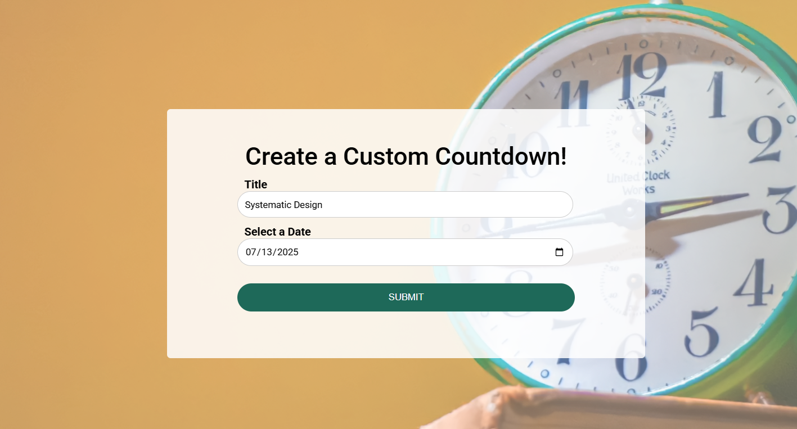

# Custom Countdown Timer

A lightweight, interactive countdown timer that lets users pick a future date and displays the time remaining in **days, hours, minutes, and seconds**. Built using **vanilla JavaScript**, **HTML**, and **CSS** — no libraries or frameworks needed.

---
## Features

-  Select any future date and time
- Live countdown display
- Auto-stops when the countdown ends
- Easily reset and start a new countdown
-  Responsive design for all devices

---
## Project Structure

```
custom-countdown/
├── index.html       # Structure of the page
├── style.css        # Styling for layout and design
└── script.js        # Countdown logic and interactivity
```

---

## Getting Started

To run the project locally:
1. Clone or download this repository.
2. Open `index.html` in your browser.    
3. Select a future date using the input field and start the countdown!


---
## How It Works

- When a user selects a future date/time:
    - The countdown calculates the difference between now and the selected time.        
    - It updates every second using `setInterval()`.
    - The remaining time is displayed dynamically on the page.
- When the countdown reaches `0`, the interval is cleared, and a message is shown.

---
##  Technologies Used

- **HTML5** – for semantic structure
- **CSS3** – for visual design and layout
- **JavaScript (ES6)** – for dynamic time calculations and updates

---
## Preview

[live-demo](https://abdo-rabea.github.io/custom-countdown)
